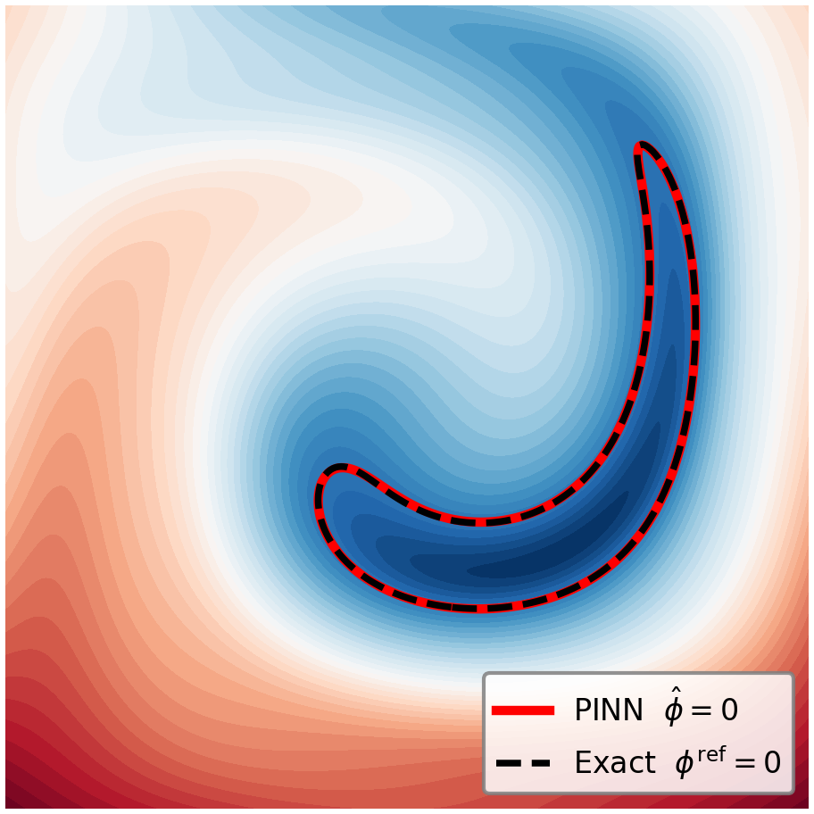
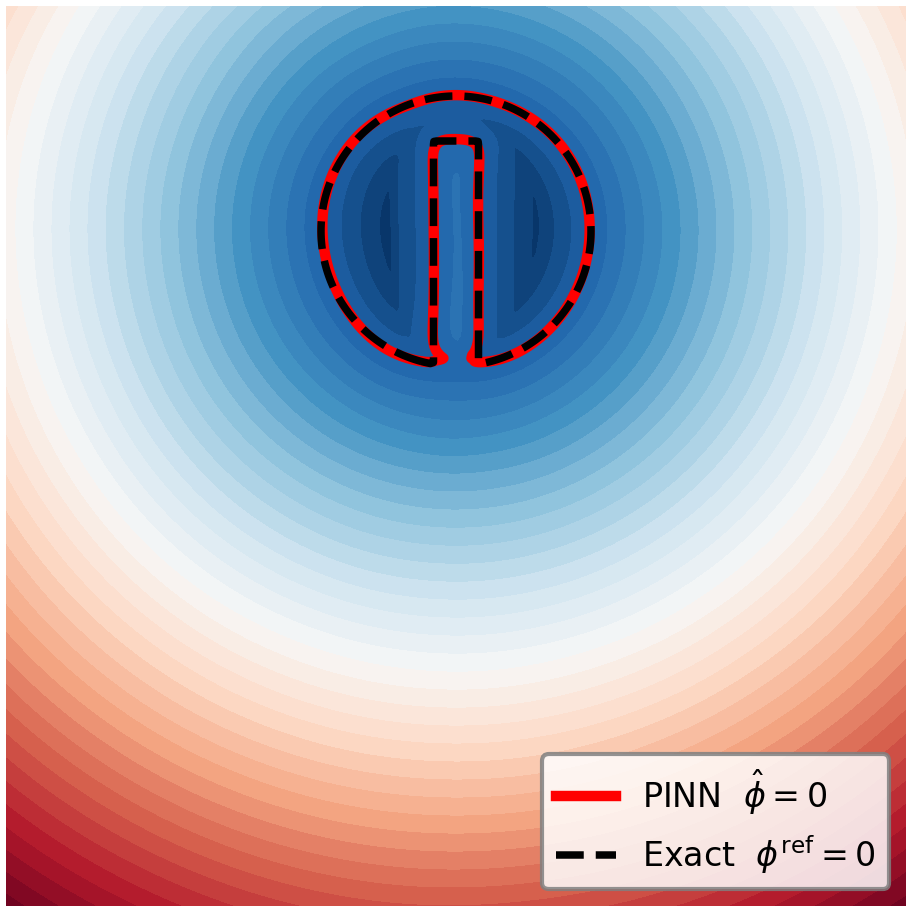

# Physics-Informed Neural Networks for Level-Set Advection

[](https://python.org)
[](https://pytorch.org)
[](LICENSE)
[](https://neduet.edu.pk)
[](https://github.com/AkbarTheAnalyst/pinn-level-set)
[](https://github.com/AkbarTheAnalyst/pinn-level-set)

> **MS Applied Mathematics Thesis** — NED University of Engineering & Technology, Karachi, Pakistan
> Reproducing standard level-set advection benchmarks using Physics-Informed Neural Networks (PINNs), evaluated against Discontinuous Galerkin (DG) reference solutions.

---

## Overview

This repository contains the full implementation of a PINN-based solver for the **level-set advection equation**:

$$\frac{\partial \phi}{\partial t} + \mathbf{u} \cdot \nabla \phi = 0, \quad (\mathbf{x}, t) \in [0,1]^2 \times [0, T]$$

The goal is to reproduce benchmark L2 errors from a DG reference study using a purely data-free, mesh-free neural network approach — no labeled solution data is used during training.

**Key findings from 47 experiments:**
- The eikonal weight is the single most critical hyperparameter: reducing it from 1.0 to 10⁻⁴ yields an **82× error reduction** on the reversed vortex benchmark.
- RFF encoding and eikonal weight are a **joint design choice**: RFF with weak eikonal performs *worse* than a plain tanh baseline.
- For the Zalesak slotted disc, a three-study programme achieves **10× total improvement** with full attribution.
- A standard 8-layer MLP achieves accuracy competitive with the PirateNet-based state of the art of Mullins et al. (2025) without residual adaptive architectures or Bayesian hyperparameter sweeps.

---

## Visual Results

<table>
<tr>
<td align="center" valign="top" width="50%">

<br>
<em>Reversed Vortex (RV) at t=T/2 (maximum interface deformation).
Time-averaged relative L² error: 0.43%.</em>
</td>
<td align="center" valign="top" width="50%">

<br>
<em>Zalesak slotted disc (ZD) at t=T (full rotation, one complete revolution).
Time-averaged relative L² error: 0.17%.</em>
</td>
</tr>
</table>

---

## Benchmarks

Four standard test cases are implemented and evaluated against DG reference errors:

| Benchmark | Description | Domain | Time Horizon |
|-----------|-------------|--------|--------------|
| **Translation** | Uniform constant velocity field | $[0,1]^2$ | $T = 5$ |
| **Rigid Rotation** | Solid-body rotation of a circle | $[0,1]^2$ | $T = 2\pi$ |
| **Reversed Vortex** | Time-reversible swirling deformation | $[0,1]^2$ | $T = 2$ |
| **Zalesak Disk** | Slotted disk rotation (sharp interface) | $[0,1]^2$ | $T = 2\pi$ |

### Final-Time $E_{L2}(T)$ vs DG (Table 13 in manuscript)

| Benchmark | DG Reference | PINN (This Work) |
|-----------|-------------|------------------|
| Translation | 2.44e-4 | 2.90e-4 |
| Rigid Rotation | 1.38e-4 | 5.92e-4 |
| Reversed Vortex | 1.99e-4 | 1.98e-3 |
| Zalesak Disk | 1.41e-3 | 8.90e-4 |

These values use the same absolute RMS metric at final time $T$ for both DG and PINN, matching manuscript Table 13.

Table 13's absolute RMS metric aligns with the DG convention for direct comparison; the time-averaged relative $L^2$ metric below aligns with the PINN literature and enables direct comparison to Mullins et al. (2025).

### Time-Averaged Relative $L^2$ Errors

| Benchmark | Avg. rel. L² error (%) |
|-----------|------------------------|
| Translation | 0.07%† |
| Rigid Rotation | 0.10%† |
| Reversed Vortex | **0.43%** |
| Zalesak Disk | **0.17%** |

†TR and RO values are computed from the study CSVs using the same time-averaged relative L² formula; they are not stated as headline metrics in the paper text. RV and ZD values are from manuscript Table 14 (comparison with Mullins et al. 2025).

---

## Experiments

The repository includes Jupyter notebooks for all experiments conducted in the study. Each benchmark has dedicated folders with notebooks and result CSV files:

- **RO_S1_scheduler_study**: Scheduler optimization for Rigid Rotation benchmark
- **RV_S1_epoch_study**: Epoch study for Reversed Vortex benchmark  
- **RV_S2_eikonal_study**: Eikonal weight study for Reversed Vortex benchmark
- **TR_S1_scheduler_study**: Scheduler study for Translation benchmark
- **TR_S2_eikonal_study**: Eikonal study for Translation benchmark
- **TR_S3_collocation_study**: Collocation points study for Translation benchmark
- **ZD_S1_eikonal_study**: Eikonal study for Zalesak Disk benchmark
- **ZD_S2_sampling_study**: Sampling study for Zalesak Disk benchmark
- **ZD_S3_architecture_study**: Architecture comparison for Zalesak Disk benchmark

To run the experiments, install dependencies with `pip install -r requirements.txt` and open the notebooks in Jupyter Lab.

---

## Architecture & Training

### Network Architecture

```
Input: (x, y, t_norm) ∈ ℝ³
  └─► 8 × [Linear(256) → Tanh]
        └─► Linear(1)
Output: φ_hat(x, y, t_norm) ∈ ℝ
```

| Hyperparameter | Value |
|----------------|-------|
| Hidden layers | 8 |
| Neurons per layer | 256 |
| Activation | Tanh |
| Weight initialization | Xavier uniform |
| Trainable parameters | 461,825 (526,593 with RFF) |

### Loss Formulation

$$\mathcal{L} = w_{\text{pde}}\mathcal{L}_{\text{pde}} + w_{\text{ic}}\mathcal{L}_{\text{ic}} + w_{\text{eik}}\mathcal{L}_{\text{eik}}$$

| Loss Term | Weight | Description |
|-----------|--------|-------------|
| $\mathcal{L}_{\text{pde}}$ | 1.0 | Level-set PDE residual |
| $\mathcal{L}_{\text{ic}}$ | 10.0 | Initial condition enforcement |
| $\mathcal{L}_{\text{eik}}$ | Benchmark-dependent (0.0001–1.0) | Eikonal regularization |

#### PDE Loss

$$\mathcal{L}_{\text{pde}} = \frac{1}{N_f} \sum_{i=1}^{N_f} \left( \partial_{t_{\text{norm}}}\hat{\phi} + T\,\mathbf{u}\cdot\nabla\hat{\phi} \right)^2$$

#### Initial Condition Loss

$$\mathcal{L}_{\text{ic}} = \frac{1}{N_i} \sum_{j=1}^{N_i} \left( \hat{\phi}(x_j,0) - \phi_0(x_j) \right)^2$$

#### Eikonal Regularization

$$\mathcal{L}_{\text{eik}} = \frac{1}{N_f} \sum_{i=1}^{N_f} \left( |\nabla\hat{\phi}| - 1 \right)^2$$

Here $t_{\text{norm}} = t/T \in [0,1]$, so the PDE residual is written in normalized time exactly as in the manuscript.

### Error Metrics (as in manuscript)

$$E_{L2}(t) = \sqrt{\frac{1}{N_g}\sum_{k=1}^{N_g}(\hat{\phi}_k - \phi_k^{\text{ref}})^2}$$

$$E_M(t) = \left|\sum_k H(-\hat{\phi}_k) - \sum_k H(-\phi_k^{\text{ref}})\right|\,\Delta x\,\Delta y$$

$$E_{L2}^{\text{rel}}(t) = \frac{\|\hat{\phi}(\cdot,t)-\phi^{\text{ref}}(\cdot,t)\|_2}{\|\phi^{\text{ref}}(\cdot,t)\|_2}, \quad \bar{E}_{L2}^{\text{rel}} = \frac{1}{N_t}\sum_{m=1}^{N_t} E_{L2}^{\text{rel}}(t_m)$$

### Training Strategy

| Phase | Optimizer | Epochs | Learning Rate |
|-------|-----------|--------|---------------|
| Phase 1 | Adam | 20,000 | 1e-3 (scheduler depends on benchmark: StepLR/CosineAnnealing) |
| Phase 2 | L-BFGS | 500 | Strong Wolfe line search |

### Collocation Points

| Set | Size | Domain |
|-----|------|--------|
| PDE collocation | 10,000 | $[0,1]^2 \times [0, T]$ |
| IC points | 5,000 | $[0,1]^2 \times \{t=0\}$ |

---

## Installation

Clone the repository:

```bash
git clone https://github.com/AkbarTheAnalyst/pinn-level-set.git
cd pinn-level-set
```

Install dependencies:

```bash
pip install -r requirements.txt
```

---

## Running Experiments

The experiments are organized in folders by benchmark and study type. Each folder contains Jupyter notebooks and a CSV file with results.

To run an experiment:

1. Navigate to the experiment folder:
   ```bash
   cd TR_S1_scheduler_study  # Example for Translation scheduler study
   ```

2. Open the notebook:
   ```bash
   jupyter notebook TR_S1_exp01.ipynb
   ```

Available experiment folders:
- `TR_S1_scheduler_study`: Translation benchmark scheduler optimization
- `TR_S2_eikonal_study`: Translation benchmark eikonal weight study  
- `TR_S3_collocation_study`: Translation benchmark collocation points study
- `RO_S1_scheduler_study`: Rigid Rotation benchmark scheduler study
- `RV_S1_epoch_study`: Reversed Vortex benchmark epoch study
- `RV_S2_eikonal_study`: Reversed Vortex benchmark eikonal study
- `ZD_S1_eikonal_study`: Zalesak Disk benchmark eikonal study
- `ZD_S2_sampling_study`: Zalesak Disk benchmark sampling study
- `ZD_S3_architecture_study`: Zalesak Disk benchmark architecture study

---

## Repository Structure

```
pinn-level-set/
├── RO_S1_scheduler_study/
│   ├── RO_S1_exp01.ipynb
│   ├── RO_S1_exp02.ipynb
│   ├── RO_S1_exp03.ipynb
│   ├── RO_S1_exp04.ipynb
│   ├── RO_S1_exp05.ipynb
│   └── RO_S1_scheduler_study.csv
├── RV_S1_epoch_study/
│   ├── RV_S1_exp01.ipynb
│   ├── RV_S1_exp02.ipynb
│   ├── RV_S1_exp03.ipynb
│   ├── RV_S1_exp04.ipynb
│   └── RV_S1_epoch_study.csv
├── RV_S2_eikonal_study/
│   ├── RV_S2_exp01.ipynb
│   ├── RV_S2_exp02.ipynb
│   ├── RV_S2_exp03.ipynb
│   ├── RV_S2_exp04.ipynb
│   ├── RV_S2_exp05.ipynb
│   ├── RV_S2_exp06.ipynb
│   └── RV_S2_eikonal_study.csv
├── TR_S1_scheduler_study/
│   ├── TR_S1_exp01.ipynb
│   ├── TR_S1_exp02.ipynb
│   ├── TR_S1_exp03.ipynb
│   ├── TR_S1_exp04.ipynb
│   ├── TR_S1_exp05.ipynb
│   └── TR_S1_scheduler_study.csv
├── TR_S2_eikonal_study/
│   ├── TR_S2_exp01.ipynb
│   ├── TR_S2_exp02.ipynb
│   ├── TR_S2_exp03.ipynb
│   ├── TR_S2_exp04.ipynb
│   ├── TR_S2_exp05.ipynb
│   └── TR_S2_eikonal_study.csv
├── TR_S3_collocation_study/
│   ├── TR_S3_exp01.ipynb
│   ├── TR_S3_exp02.ipynb
│   ├── TR_S3_exp03.ipynb
│   ├── TR_S3_exp04.ipynb
│   ├── TR_S3_exp05.ipynb
│   ├── TR_S3_exp06.ipynb
│   └── TR_S3_collocation_study.csv
├── ZD_S1_eikonal_study/
│   ├── ZD_S1_exp01.ipynb
│   ├── ZD_S1_exp02.ipynb
│   ├── ZD_S1_exp03.ipynb
│   ├── ZD_S1_exp04.ipynb
│   ├── ZD_S1_exp05.ipynb
│   ├── ZD_S1_exp06.ipynb
│   └── ZD_S1_eikonal_study.csv
├── ZD_S2_sampling_study/
│   ├── ZD_S2_exp01.ipynb
│   ├── ZD_S2_exp02.ipynb
│   ├── ZD_S2_exp03.ipynb
│   ├── ZD_S2_exp04.ipynb
│   └── ZD_S2_sampling_study.csv
├── ZD_S3_architecture_study/
│   ├── ZD_S3_exp01.ipynb
│   ├── ZD_S3_exp02.ipynb
│   ├── ZD_S3_exp03.ipynb
│   ├── ZD_S3_exp04.ipynb
│   ├── ZD_S3_exp05.ipynb
│   ├── ZD_S3_exp06.ipynb
│   └── ZD_S3_architecture_study.csv
├── assets/
│   ├── fig_RV_GA_tT2.png
│   └── fig_ZD_GA_tT.png
├── requirements.txt
├── README.md
└── LICENSE
```

---

## Key Design Decisions

**Why Eikonal Regularization?**
Without it, the level-set function $\phi$ can develop steep gradients or flat regions that make accurate interface tracking difficult. The eikonal loss encourages $\|\nabla\phi\| \approx 1$, keeping $\phi$ a well-behaved signed distance function throughout training.

**Why Two-Phase Training?**
Adam efficiently explores the loss landscape in early training but plateaus near local minima. L-BFGS with strong Wolfe conditions provides second-order convergence in the fine-tuning phase, which is critical for reaching low L2 errors comparable to DG methods.

**Why High IC Weight ($w_{\text{ic}} = 10$)?**
The initial condition anchors the entire spatio-temporal solution. Underweighting it causes the network to drift from the correct initial interface shape, compounding errors over time.

**Why Zalesak Disk?**
The Zalesak slotted disk is a particularly demanding benchmark due to its sharp corners and thin slot, which require the network to resolve steep gradients in $\phi$ without numerical diffusion. It is the standard stress test for interface tracking methods.

---

## Results & Visualizations

All planned benchmark studies in this thesis repository have been completed and uploaded.

### Final Benchmark Errors ($E_{L2}(T)$)

| Benchmark | DG Reference | PINN (This Work) |
|-----------|-------------|------------------|
| Translation | 2.44e-4 | 2.90e-4 |
| Rigid Rotation | 1.38e-4 | 5.92e-4 |
| Reversed Vortex | 1.99e-4 | 1.98e-3 |
| Zalesak Disk | 1.41e-3 | 8.90e-4 |

### Available Outputs in This Repository

- Loss convergence histories (Adam and L-BFGS phases) are included in experiment notebooks.
- Interface and contour evolution visualizations are included in benchmark notebooks.
- Study summaries are provided in CSV files within each experiment folder.
- Completed study folders:
   - `TR_S1_scheduler_study`, `TR_S2_eikonal_study`, `TR_S3_collocation_study`
   - `RO_S1_scheduler_study`
   - `RV_S1_epoch_study`, `RV_S2_eikonal_study`
   - `ZD_S1_eikonal_study`, `ZD_S2_sampling_study`, `ZD_S3_architecture_study`

---

## References

- Raissi, M., Perdikaris, P., & Karniadakis, G. E. (2019). Physics-informed neural networks: A deep learning framework for solving forward and inverse problems involving nonlinear partial differential equations. *Journal of Computational Physics*, 378, 686–707.

- Sethian, J. A. (1999). *Level Set Methods and Fast Marching Methods*. Cambridge University Press.

- Zalesak, S. T. (1979). Fully multidimensional flux-corrected transport algorithms for fluids. *Journal of Computational Physics*, 31(3), 335–362.

- Osher, S., & Sethian, J. A. (1988). Fronts propagating with curvature-dependent speed: Algorithms based on Hamilton-Jacobi formulations. *Journal of Computational Physics*, 79(1), 12–49.

- Raees, F. (2016). *A Mass-Conserving Hybrid Interface Capturing Method for Geometrically Complicated Domains*. PhD thesis, Delft University of Technology.

- Mullins, M., Kamil, H., Fahsi, A., & Soulaïmani, A. (2025). Physics-informed neural networks for solving moving interface flow problems using the level set approach. *Physics of Fluids*, 37(10), 107124.

- Wang, S., Sankaran, S., & Perdikaris, P. (2024). Respecting causality for training physics-informed neural networks. *Computer Methods in Applied Mechanics and Engineering*, 421, 116813.

- Tancik, M. et al. (2020). Fourier features let networks learn high frequency functions in low dimensional domains. *NeurIPS*, 33, 7537–7547.

- Krishnapriyan, A., Gholami, A., Zhe, S., Kirby, R., & Mahoney, M. W. (2021). Characterizing possible failure modes in physics-informed neural networks. *Advances in Neural Information Processing Systems*, 34, 26548–26560.

- Wang, S., Li, B., Chen, Y., & Perdikaris, P. (2024). PirateNets: Physics-informed deep learning with residual adaptive networks. *Journal of Machine Learning Research*, 25, 1–51.

- Wang, S., Yu, X., & Perdikaris, P. (2022). When and why PINNs fail to train: A neural tangent kernel perspective. *Journal of Computational Physics*, 449, 110768.

- Glorot, X., & Bengio, Y. (2010). Understanding the difficulty of training deep feedforward neural networks. In *Proceedings of the 13th International Conference on Artificial Intelligence and Statistics (AISTATS)*, 9, 249–256.

- Kingma, D. P., & Ba, J. (2015). Adam: A method for stochastic optimization. In *International Conference on Learning Representations (ICLR)*.

---

## Citation

If you use this work, please cite:

```bibtex
@article{akbar2026ijnmf,
  author  = {Muhammad Akbar Khan and Fahim Raees},
  title   = {A Systematic Study of Physics-Informed Neural Networks
             for Level-Set Interface Advection},
  journal = {International Journal for Numerical Methods in Fluids},
  year    = {2026},
  note    = {Under review. Manuscript ID 4725011.
             First author ORCID: 0009-0001-7956-0080}
}

@mastersthesis{akbar2026pinn,
  author  = {Muhammad Akbar Khan},
  title   = {A Systematic Study of Physics-Informed Neural Networks for Level-Set Interface Advection},
  school  = {NED University of Engineering and Technology},
  year    = {2026},
  address = {Karachi, Pakistan}
}
```

---

## Author

**Muhammad Akbar Khan**
MS Applied Mathematics, NED University of Engineering & Technology
Research Interests: Scientific Machine Learning · PINNs · Numerical PDEs · Neural Operators

akbar.bsma1337@gmail.com · [GitHub](https://github.com/AkbarTheAnalyst) · [ORCID 0009-0001-7956-0080](https://orcid.org/0009-0001-7956-0080) · [Website](https://akbarkhan.dev) · [LinkedIn](https://linkedin.com/in/muhammad-akbar-khan-826129204)

Supervisor: Dr. Fahim Raees, Associate Professor, NED University (PhD, TU Delft 2016)

---

*This work is part of an MS thesis conducted under supervision at NED University of Engineering & Technology, Karachi, Pakistan.*
